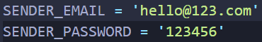
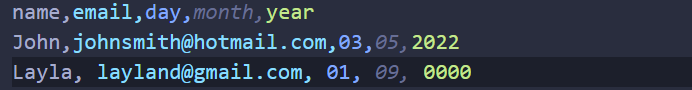

# Auto Birthday Wisher 🎂

### First download a zip copy or git clone of the project to your local computer.

 

### Go to the main.py file and add your credentials to the variables called SENDER_EMAIL and SENDER_PASSWORD:

>Note: If you are using google mail or gmail you'll have to turn on less secure apps settings on the google account you are using as sender.

## How does it work:

 

### There is one birthdays.csv file that contains data of each person's info that looks like this:

>Note: the year does not matter here you can set it to whatever you want. Add your friend's data here formatted like above image.

 

### And there's another file called quotes.txt that holds some birthday quotes separated by new line...

>Note: you can also add your own quotes separating them with newline.

 

*So when the program is executed, it will look through all the entries in the birthdays.csv file and check if any of the person's birthday matches today's date.*

*If yes, in that case the program will automatically pick a random quote from the 'quotes.txt' file and then send it via email to one or more (if there are multiple persons with same birthday) person(s) that has birthday today.*

> Also: It will print who or whom the message(s) sent to.

 

**It is recommended to run the program using cloud services like <a href="https://pythonanywhere.com">pythonanywhere.com</a> to run the code everyday at a specified time.**

 

**So even when you fall asleep the program will run and send the birthday wish to your friends and family.**

**Let's keep it a secret between you and me that you are a programmer, don't let them know 😜.**

## Happy wishing 👋.